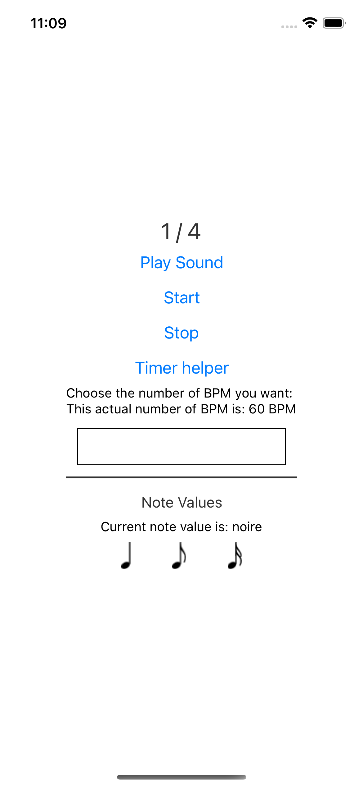

# A Guitarist's Best Friend

Open source metronome built with React Native.

**I know, the design is pretty rough at the moment**.

---

## Prerequis

In order to make this project works locally, we'll need the following:

- NodeJS (18.13 is recommended).
- Npm (8.13) or yarn (1.22)
- Xcode

**It seems there are problems if you want to play sound on the simulator. I
suggest you use a real device instead.**

This project relies on the managed Expo App. It should make your Installation
and setup quite easy.

## Installation

- Clone the repo.
- Run `yarn` or `npm i` - this will install the project.
- Run `yarn start` or `npm start` - this will launch the expo app.
- Scan the QR code with your iPhone or iPad.

## Testing

This project uses Jest for testing purpose. I haven't added the component
testing suites yet. There are only unit tests at the moment.

- `yarn test` - run the tests once.
- `yarn test --watch` - run the tests each time there is a modification/

## Formatting and Litting

This project uses Prettier and Eslint for Developer experience purposes. You
can either use the editor pluggin of your choice OR run the following commands:

- `yarn format` or `npm run format` - will format all the code. It uses
  Prettier default config.
- `yarn lint` or `npm run lint` - will run eslint and check for litting
  problems. 

